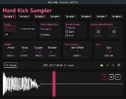

# Hard Kick Sampler

A VST3/CLAP plugin for working with hardstyle kicks. Load up to 4 different kick layers (punch, transient, crunch, bass) and control each one independently with pitch shifting, ADSR, and other parameters.



## What it does

This is a multi-sample sampler designed specifically for hardstyle kicks. You can load different parts of a kick into separate slots and tweak them individually. Want to pitch shift the whole kick but keep the punch at its original pitch? You can do that. Need to adjust the attack of just the bass layer? Also doable.

Each sample slot has its own controls:
- **Mute** - turn layers on/off
- **Tonal** - tonal adjustment
- **Gain** - volume control
- **Root note** - base pitch reference
- **Semitone offset** - pitch adjustment in semitones
- **ADSR** - envelope shaping
- **Start offset** - where to start playback in the sample
- **Blend group** - how samples mix together
- **Shift kind** - pitch shifting algorithm (sample rate conversion or PSOLA)

## Building

After installing [Rust](https://rustup.rs/), you can compile Hard Kick Sampler as follows:

```shell
cargo xtask bundle hard_kick_sampler --release
```

## Installation

The compiled plugin should work on Windows, macOS, and Linux (though only tested on Windows). Drop the built plugin file into your DAW's VST3 or CLAP plugin folder.

## Usage

1. Load the plugin in your DAW
2. Click the folder button to load audio samples into each slot
3. Tweak the parameters for each layer
4. Play notes to trigger the kick

## License

AGPL-3.0 (required due to dependencies)

## Status

This was my first VST plugin and served as a learning project. It's now feature-complete but no longer actively developed. Feel free to fork if you want to expand on it.